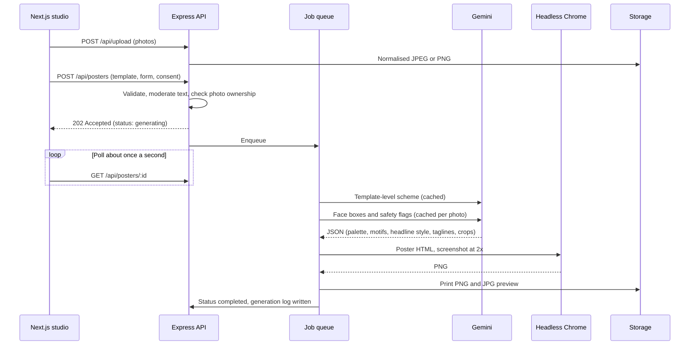

<div align="center">

# Posterghor (পোস্টারঘর)

**Print-ready Bangla political posters, typeset exactly as you write them.**

Fill in a short form, add photos, and an AI art director designs the poster. Your Bangla text is set from real fonts, letter for letter, and exported at 2400×3200 px.

[Live demo](https://posterghor-web.vercel.app) · [Getting started](#getting-started) · [Deployment](#deployment) · [API reference](#api-reference)


</div>

## Contents

- [Overview](#overview)
- [Features](#features)
- [Getting started](#getting-started)
- [Configuration](#configuration)
- [How generation works](#how-generation-works)
- [Templates](#templates)
- [API reference](#api-reference)
- [Security and moderation](#security-and-moderation)
- [Testing](#testing)
- [Deployment](#deployment)
- [Project structure](#project-structure)
- [Design system](#design-system)
- [Roadmap](#roadmap)

## Overview

Image models draw letters as pictures, so Bangla conjuncts and vowel signs often come out garbled. Posterghor never asks an AI to draw text. Gemini makes small design decisions (colours, decoration, photo crops), and a deterministic layout engine renders the poster with the user's exact words.

| | Image model draws the whole poster | Posterghor |
|---|---|---|
| Bangla spelling | Conjuncts and matras are often wrong | Typeset from real fonts with proper shaping, exactly as typed |
| Text placement | Approximate | Auto-fitted to its box, pixel exact |
| Print quality | 1 to 2 megapixel raster | 2400×3200 PNG, JPG, and a PDF with vector text |
| Cost and latency | One image call per poster | Small, cached Gemini calls only |
| Role of AI | Draws everything | Chooses palette and decoration, finds faces for clean crops, suggests taglines, screens photos |

Gemini never sees or edits the user's Bangla text. It returns validated JSON (colours, decoration ids, crop boxes), and the layout engine turns that JSON and the user's content into pixels.

## Features

**Core**

- **Template library:** six designs across five occasions (Victory Day, tribute, election campaign, greetings, Eid and festivals), filterable by occasion.
- **Studio:** headline, supporting line, date, name, designation, party, union, thana, district, credit label, and up to three photos with captions. The live preview uses the same engine as the server.
- **Asynchronous generation:** `POST /api/posters` returns immediately and the client polls for progress.
- **Regenerate and edit:** limited retries (three by default), every version is kept and switchable, and text fixes re-render without changing the look.
- **Export:** PNG (2400×3200), JPG, and PDF with vector text.
- **History:** every poster is saved to the user's account for re-download.
- **Admin panel:** usage and cost dashboard, template editor with live JSON preview, moderation queue, user management, AI and render logs.
- **Authentication:** JWT, with email or Bangladeshi mobile number and password.
- **Rate limiting:** global, authentication, generation, uploads, AI suggestions, and a daily poster cap.

**Extras**

- One, two and three photo layouts with seven frame styles (arch, circle, rounded, hexagon, soft fade, polaroid, transparent cut-outs).
- Headline font selection from six Bangla display faces.
- Bulk mode: upload a CSV of names and get one poster per person, with live progress and a ZIP download.
- Bilingual interface (Bangla and English) with Bangla-first typography.
- AI colour schemes with curated colourways as fallback, and AI headline suggestions.

## Getting started

**Requirements:** Node.js 22.12 or newer and npm. No database, storage account or API key is needed to run everything locally.

```bash
git clone https://github.com/ash-rafhamid/posterghor.git
cd posterghor
npm install     # installs all workspaces and downloads Chrome for the renderer (about 170 MB)
npm run seed    # creates demo accounts and renders the template thumbnails
npm run dev     # API on :4000, web on :3000
```

Open <http://localhost:3000>. The seed creates these accounts for development only:

| Role | Login | Password |
|---|---|---|
| User | `demo@poster.local` | `Demo@12345` |
| Admin | `admin@poster.local` | `Admin@12345` |

In the studio, choose **Try sample portraits** to run the whole flow without uploading photos.

**First run.** With no `MONGODB_URI`, the API starts an embedded MongoDB through `mongodb-memory-server` and downloads the `mongod` binary once (about 780 MB on Windows, cached in `~/.cache/mongodb-binaries`). To skip that, point `MONGODB_URI` at a local MongoDB or an Atlas cluster in `apps/api/.env`. Commands such as `npm run seed` and `npm run smoke` also work while `npm run dev` is running, because they attach to the same embedded database.

**Enabling Gemini (optional).**

```bash
cp apps/api/.env.example apps/api/.env
# then set GEMINI_API_KEY (https://aistudio.google.com/apikey)
```

Without a key, the app works end to end: colour schemes come from each template's curated colourways, and photo crops come from a local skin-tone estimator. With a key you also get AI palettes, face-aware crops, photo safety flags and headline suggestions.

**Development runner.** `npm run dev` restarts the API through `apps/api/scripts/dev.mjs` when a source file in `apps/api/src` or `packages/shared/src` changes. Node's built-in `--watch` treats a file being merely read as a change on Windows (NTFS last-access updates), which restarted the API at random moments, so this runner compares modification times instead. Changes to `.env` need a manual restart.

## Configuration

API settings live in `apps/api/.env` (see [`.env.example`](apps/api/.env.example)). Every value is optional in development, and empty values are treated as unset.

| Variable | Purpose | Default |
|---|---|---|
| `MONGODB_URI` | MongoDB or Atlas connection string | Embedded MongoDB (required in production) |
| `JWT_SECRET` | Signs authentication tokens | Development secret (required in production) |
| `PUBLIC_API_URL` | Public URL of this API | `http://localhost:4000` |
| `CORS_ORIGINS` | Allowed web origins, comma separated | `http://localhost:3000` |
| `CLOUDINARY_URL` | File storage (or `CLOUDINARY_CLOUD_NAME`, `_API_KEY`, `_API_SECRET`) | Local `./uploads` |
| `GEMINI_API_KEY` | Enables AI art direction | Off |
| `GEMINI_TEXT_MODEL`, `GEMINI_IMAGE_MODEL`, `GEMINI_BASE_URL` | Model selection | `gemini-flash-latest`, `gemini-3.1-flash-image` |
| `AI_BACKDROPS_ENABLED` | AI-painted background plates (cached) | `false` |
| `MAX_REGENERATIONS`, `DAILY_POSTER_LIMIT`, `MAX_UPLOAD_MB` | Product limits | `3`, `60`, `12` |
| `RENDER_CONCURRENCY`, `CHROME_PATH` | Renderer settings | `2`, bundled Chrome |
| `ADMIN_EMAIL`, `ADMIN_PASSWORD` | Admin account created by the seed | `admin@poster.local`, `Admin@12345` |

The web app reads one variable from `apps/web/.env.local`: `NEXT_PUBLIC_API_URL` (default `http://localhost:4000`).

## How generation works



1. **Photos** are re-encoded on the server: EXIF rotation applied, metadata stripped, longest side capped at 2000 px. Transparent PNGs are kept and rendered as cut-outs.
2. **Art direction** (`apps/api/src/services/ai/art-director.ts`) has three parts:
   - **Scheme:** a text-only Gemini call returns a palette of 13 colours, three to eight decoration ids, a headline treatment, a photo filter and three Bangla taglines. Every colour is re-validated as hex, contrast is re-checked, and unknown motifs are dropped.
   - **Photos:** one batched call returns a face bounding box per photo (used for focal point and zoom) plus safety flags for explicit content, violence and hate symbols.
   - **Fallback:** any failure (no key, quota, malformed output) degrades to a curated colourway and a local focal-point estimate, so a poster always completes.
3. **Rendering:** `@poster/shared` turns the template layout, content and scheme into a React tree, then into HTML with fonts inlined as base64. Headless Chrome (network isolated) captures a 2400×3200 PNG. A text-fitting pass shrinks each Bangla line until it fits its box.
4. **Storage:** the PNG and a JPG preview are stored. PDFs are rendered on demand with vector text (about 2 MB).

### Cost control

| Cached item | Cache key | Effect |
|---|---|---|
| Colour scheme and taglines | Template, variant and layout fingerprint | Everyone using the same template shares one Gemini call |
| Face boxes and safety flags | SHA-1 of the photo thumbnail | Regenerating never re-sends photos |
| Headline suggestions | Occasion and tone | No personal data is sent, and one call serves many users |
| AI background plate (optional) | Template and variant | One image call per design |

Every attempt writes a `GenerationLog` row (model, prompt, tokens, latency, render time, cache hit, source), which the admin dashboard aggregates. Gemini receives template metadata and 512 px photo thumbnails, and for suggestions only the occasion. It never receives names, headlines or other typed text.

`npm run test:gemini` verifies the integration without a key. It starts a local fake Gemini server that speaks the real REST format and points the official SDK at it (25 checks covering structured output, token accounting, caching, face-box maths, safety flags, malformed output and fallbacks).

## Templates

A template is a MongoDB document with a `layoutConfig` JSON (see `packages/shared/src/poster/types.ts`): theme id, palette, photo slots for one, two and three photos, text slots, decoration set, colourways and headline style. Themes draw the artwork as procedural SVG (sunburst, paddy field, doves, flags, shapla, candles, lanterns, alpona, mosque skyline).

To add or change a template:

- Use **Admin, Templates** to edit the JSON with validation and a live preview. The thumbnail re-renders on save.
- Or add a preset in `packages/shared/src/poster/presets/` and run `npm run seed`.

## API reference

All endpoints exchange JSON. Authenticated routes expect `Authorization: Bearer <jwt>`. Errors have the shape `{ message, code, details? }`.

| Method and path | Access | Description |
|---|---|---|
| `POST /api/auth/register`, `POST /api/auth/login` | Public | Email or mobile (`01XXXXXXXXX`, `+8801...`) and password, returns `{ user, token }` |
| `GET /api/auth/me` | User | Current user |
| `GET /api/templates`, `GET /api/templates/:id` | Public | Active templates, filterable by `occasion`, by id or slug |
| `GET /api/config` | Public | Deployment capabilities and limits |
| `POST /api/upload` | User | Multipart `file`, returns `{ url, width, height, hasAlpha }` |
| `POST /api/posters` | User | `{ templateId, formData, consent }`, returns `202` with status `generating` |
| `GET /api/posters/:id` | User | Status, progress stage, result URLs, versions, art-direction notes |
| `GET /api/posters`, `GET /api/posters/user/:userId` | User | Paginated history (own posters, or any user for admins) |
| `POST /api/posters/:id/regenerate` | User | `{ formData?, keepStyle? }`, limited retries |
| `PATCH /api/posters/:id/version` | User | Make an earlier version current |
| `GET /api/posters/:id/download?format=png\|jpg\|pdf` | User | Print file |
| `DELETE /api/posters/:id` | User | Delete a poster and its files |
| `POST /api/posters/bulk`, `GET /api/posters/batch`, `GET /api/posters/bulk/zip` | User | CSV rows to posters, batch polling, ZIP download |
| `POST /api/ai/suggest` | User | Bangla headline ideas |
| `GET /api/admin/stats`, `GET /api/admin/posters`, `PATCH /api/admin/posters/:id/moderation` | Admin | Dashboard, moderation queue, approve, flag or block |
| `GET/POST /api/admin/templates`, `PATCH/DELETE /api/admin/templates/:id` | Admin | Template management (delete deactivates if posters exist) |
| `GET /api/admin/logs`, `GET/PATCH /api/admin/users` | Admin | Generation logs, suspend or promote users |

**Data model** (`apps/api/src/models`): `User`, `Template`, `Poster`, `GenerationLog` and `AiCache` (shared AI outputs with a 90-day TTL).

## Security and moderation

- **Text screening** runs on every create and regenerate. Clear incitement and abuse is blocked with an explanation, and sensitive but legitimate slogans are flagged into the admin queue. Rules cover Bangla and English and are tuned to avoid false positives on past-tense news phrasing.
- **Photo screening** by Gemini flags explicit content, graphic violence and hate symbols for review. A consent checkbox for photo rights is mandatory.
- **Admin controls:** admins can approve, flag or block any poster. Blocked posters disappear for the owner and cannot be downloaded.
- **Hardening:** bcrypt password hashing, JWT (HS256), Helmet, a CORS allow-list, zod validation on every input, uploads re-encoded with sharp, timing-safe login and per-user rate limits.
- **SSRF protection:** photo URLs must point into the caller's own upload folder (checked segment by segment, rejecting traversal and query-string tricks), and the renderer blocks all network requests.

## Testing

```bash
npm test               # unit tests (Node's built-in runner, no extra dependencies)
npm run typecheck      # all workspaces
npm run smoke          # end-to-end against a running API
npm run test:gemini    # Gemini integration against a local fake server
```

The unit tests cover the areas where a silent mistake would hurt most:

- **Poster engine:** every template, photo count and colourway renders valid markup, all 24 curated colourways keep text legible (WCAG contrast), every slot stays on the canvas, and hostile text or colours cannot inject HTML or CSS into the page the renderer prints.
- **Schemas and Bangla text:** email and Bangladeshi mobile parsing (including Bangla digits), limits, consent, preservation of ZWJ and ZWNJ, grapheme-aware counting.
- **Security:** the photo URL allow-list, JWT handling (`alg: none`, tampering, expiry, role escalation), and image intake (EXIF stripped, SVG and non-images rejected).
- **Moderation:** block, flag and clean decisions on Bangla and English samples, including false-positive cases.

The smoke test covers sign-in, upload, moderation, the SSRF guard, generation, PNG/JPG/PDF export, regeneration limits, bulk ZIP, admin actions and deletion.

## Deployment

The reference setup uses free tiers of four services. The API needs a long-running server with Chrome, so it does not run on serverless functions.

| Part | Service | Notes |
|---|---|---|
| Web (Next.js) | Vercel | Root directory `apps/web` |
| API | Render (Docker) | Uses `render.yaml` and `apps/api/Dockerfile`, which bundles Chromium |
| Database | MongoDB Atlas | Free M0 cluster |
| Photo storage | Cloudinary | Required in production because the API disk is ephemeral |

1. **MongoDB Atlas.** Create a free cluster, add a database user, allow network access from `0.0.0.0/0`, and copy the connection string.
2. **Cloudinary.** Create an account and copy the `CLOUDINARY_URL` value.
3. **Render.** Choose *New, Blueprint* and select this repository. Set `MONGODB_URI`, `CLOUDINARY_URL`, `PUBLIC_API_URL` (the service's own URL) and `CORS_ORIGINS` (the Vercel URL). `GEMINI_API_KEY` is optional. The blueprint uses the free plan (512 MB) with `RENDER_CONCURRENCY=1` and `RENDER_LOW_MEMORY=true`, which restarts Chrome after every poster to keep memory low. Free instances sleep after 15 minutes idle (the first request then takes about a minute). The `starter` plan is also 512 MB but always on, and the `standard` plan (2 GB) suits heavy bulk runs.
4. **Vercel.** Import the repository, set **Root Directory** to `apps/web`, and add `NEXT_PUBLIC_API_URL` with the Render URL. Then set the Vercel URL as `CORS_ORIGINS` on Render.
5. **Seed once** from your machine, with the same connection strings and your own admin credentials:

   ```bash
   MONGODB_URI="..." CLOUDINARY_URL="..." ADMIN_EMAIL="you@example.com" ADMIN_PASSWORD="choose-a-strong-one" npm run seed
   ```

The generation queue runs in-process on a single instance. To scale horizontally, replace `apps/api/src/services/queue.ts` with BullMQ and Redis. Nothing else has to change.

## Project structure

```
apps/
  api/           Express 5 API (TypeScript, bundled with tsup)
    src/config, models, middleware, routes
    src/services/ai        Gemini wrapper, art director, prompts, cache, suggestions
    src/services/render    Headless Chrome renderer (queue, retries, PDF)
    src/services/storage   Cloudinary and local disk providers
    src/scripts            seed, smoke, test-gemini, samples, og, render-demo
    src/__tests__          Unit tests
    scripts/dev.mjs        Development runner
  web/           Next.js 16 App Router (Tailwind CSS v4, Motion, TanStack Query)
    src/app                Landing, templates, create, bulk, posters, history, auth, admin
    src/components         studio, poster, marketing, admin, ui
    src/i18n               English and Bangla dictionaries
packages/
  shared/        Poster engine and zod schemas, used by both apps
    src/poster             Engine, themes, motifs, presets, text fitter
```

`@poster/shared` is the core of the project. The browser preview and the server render call the same `resolvePoster()` and `<PosterCanvas />`, so what you see in the studio is what gets printed.

## Design system

The interface is inspired by Bangladeshi rickshaw art and street signboards rather than a typical SaaS look. It uses saturated enamel colours on an ultramarine canvas, thick violet-black outlines, hand-lettered headlines, and decoration borrowed from rallies and shop fronts: an awning, paper bunting, spoked wheels, arched panels and string-lit poster frames.

- **Colour:** ultramarine, hot pink, marigold, turquoise, leaf green and violet-black ink, with white plates for content. The tokens are defined in [`apps/web/src/app/globals.css`](apps/web/src/app/globals.css), so the whole palette can be changed in about twenty lines.
- **Typography:** Baloo Da 2 for headlines and buttons (Bangla and Latin in one voice), Galada for brush accents, Hind Siliguri for body text. Headlines use a painted outline effect that works with Bangla conjuncts.
- **Ornaments:** hand-built SVG components in [`components/ui/ornaments.tsx`](apps/web/src/components/ui/ornaments.tsx), coloured from the theme tokens.
- **Motion:** subtle sway and a wheel that rolls along the how-it-works road on scroll. All animation respects the operating system's reduced-motion setting.

## Roadmap

- Background removal for uploaded portraits (transparent PNGs are treated as cut-outs today).
- A shared job queue (BullMQ and Redis) for multi-instance deployments.
- Payment gateway support (bKash, Nagad) and watermark tiers.
- Photographic template backgrounds (the optional AI backdrop needs a Gemini image quota).

## Acknowledgements

Fonts are licensed under the SIL Open Font License and served through `@fontsource`: Baloo Da 2, Galada, Hind Siliguri, Anek Bangla, Noto Sans and Serif Bengali, Tiro Bangla and Atma.

Political content is the responsibility of the poster's author. Please use only photos you have the right to use.
