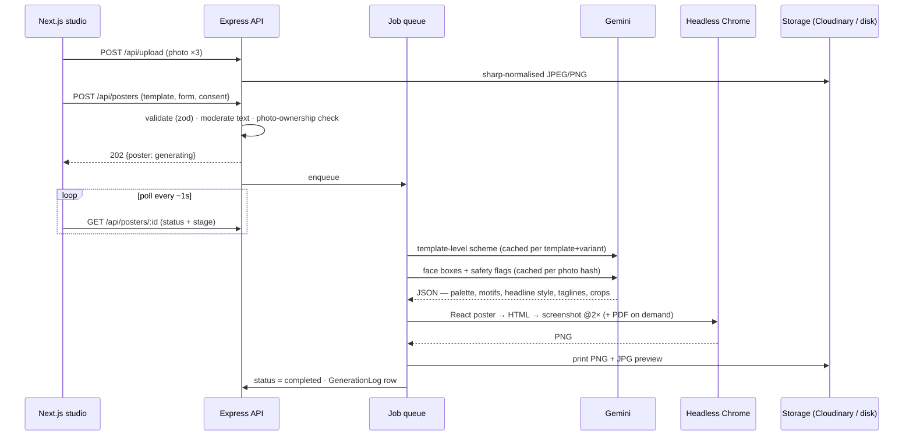

<div align="center">

# পোস্টারঘর · Posterghor

**AI Political Poster Maker** — print-ready Bangla posters in minutes.
Fill a short form, drop in photos, and Gemini art-directs a poster in the spirit of real Bangladeshi street posters —
with your Bangla text set **letter-for-letter exactly as you typed it**.

`Next.js 16` · `Express 5` · `MongoDB (Mongoose 9)` · `Gemini API` · `Puppeteer` · `TypeScript` end-to-end

</div>

---

## Why this is built the way it is

The brief offers two ways to use Gemini. This project implements **Option B — AI-assisted layout + HTML render**, because Bangla
inside AI-generated images is unreliable (melted conjuncts, wrong matras):

| | Image model draws the poster | **Posterghor** |
|---|---|---|
| Bangla spelling | ❌ garbles conjuncts / vowel signs | ✅ typeset from real fonts (HarfBuzz shaping) — exactly what the user typed |
| Text placement | ❌ approximate | ✅ auto-fitted to its box, pixel-exact |
| Print quality | ❌ 1–2 MP raster | ✅ 2400×3200 PNG, JPG, and a **vector-text PDF** |
| Cost / latency | 💸 an image call per poster | ✅ Gemini only makes small, **cached** decisions |
| What AI does | draws everything | picks the **palette & decoration**, finds each **face** for a clean crop, writes **tagline ideas**, screens photos |

> Gemini never sees or edits the user's Bangla text. It returns validated JSON (colours, decoration ids, crop boxes); a deterministic
> layout engine turns that JSON + the user's content into pixels.

## Features

**MVP (all delivered)**
- **Template library** — 6 seeded designs across the 5 occasions (বিজয় দিবস, শোক/স্মরণ, নির্বাচনী প্রচার ×2, শুভেচ্ছা, ঈদ/উৎসব), filterable by occasion.
- **Studio form** — headline, supporting line, date, name, designation, party/org, union/thana/district, credit label (প্রচারে …), up to 3 photos with captions. **Live preview** re-renders as you type using the *same engine* as the server.
- **AI generation** — async job (`POST /api/posters` → status polling) with a real progress screen.
- **Preview & regenerate** — limited retries (default 3), every version is kept and switchable; "edit text" re-renders a typo fix without changing the look.
- **Export** — PNG (2400×3200, lossless), JPG, PDF (vector text). Min. requirement 1200×1600 is exceeded 2×.
- **History** — every poster saved per account, re-downloadable.
- **Admin panel** — dashboard (usage, Gemini tokens, cache hit rate, render times), template CRUD with a **live JSON layout editor + preview**, moderation queue (approve / flag / block), users, AI & render logs.
- **Auth** — JWT, email **or** Bangladeshi mobile number + password.
- **Rate limiting** — global, auth, generation (per user), uploads, AI suggestions, plus a daily poster cap.

**Stretch goals also delivered**
- Multiple photo layouts (1-up / 2-up / 3-up, auto) and 7 photo frames (arch, circle, rounded, hexagon, soft-fade, polaroid, transparent cut-outs).
- Bangla **headline font selection** (6 display faces).
- **Bulk generation** — one CSV of names → one poster per person, live progress, **ZIP download**.
- Fully **bilingual UI** (বাংলা / English), Bangla-first typography.
- Curated colourways + AI colour schemes, "Suggest with AI" Bangla headline ideas.
- *(Not built: payment gateway, watermark removal.)*

## Design language — "rickshaw enamel" (রিকশা আর্ট)

The interface is deliberately **not** the usual cream-paper / serif / rounded-card look. It borrows from Bangladeshi rickshaw and
street-signboard painting: saturated enamel colours on an ultramarine panel, thick violet-black outlines, hand-lettered headlines,
and the trimmings of a rally or a shop-front — striped **awning**, paper **bunting**, spoked **wheels**, **arched** panels,
**string-lit** poster frames, drawing-pins, coins and medallions.

- **Colour** — ultramarine canvas · hot pink · marigold · turquoise · leaf green · violet-black ink, with white "plates" for content. Tokens live in
  [`apps/web/src/app/globals.css`](apps/web/src/app/globals.css) (`@theme static`), so re-skinning the whole site is a matter of editing ~20 lines.
- **Type** — *Baloo Da 2* (headlines and buttons, Bangla + Latin in one voice), *Galada* (brush accents), *Hind Siliguri* (body). Headlines use a
  "painted" effect (outline + stacked shadows) that works with Bangla conjuncts.
- **Ornaments** — all hand-built SVG in [`components/ui/ornaments.tsx`](apps/web/src/components/ui/ornaments.tsx) and coloured from the theme tokens.
- **Motion** — sway, bob and a wheel that rolls down the how-it-works road as you scroll; every animation honours the OS *reduce motion* setting.

## Quick start

Requires **Node.js ≥ 22.12** and npm. No database, storage or API keys are needed to try everything.

```bash
npm install          # installs all workspaces (downloads a Chrome for the renderer, ~170 MB)
npm run seed         # creates the admin + demo users and renders the 6 template thumbnails
npm run dev          # API on :4000, web on :3000
```

Open **http://localhost:3000**. Demo accounts (created by the seed, development only):

| Role | Login | Password |
|---|---|---|
| User | `demo@poster.local` | `Demo@12345` |
| Admin | `admin@poster.local` | `Admin@12345` |

Tip: in the studio, click **"No photo handy? Try sample portraits"** to run the whole flow without uploading anything.

Script commands (`npm run seed`, `npm run smoke`, …) also work **while `npm run dev` is running** — they attach to the embedded database instead of starting a second one.

> **First run note:** with no `MONGODB_URI` the API starts an **embedded MongoDB** (via `mongodb-memory-server`) and downloads the
> `mongod` binary once (~780 MB on Windows, cached in `~/.cache/mongodb-binaries`). To skip that, set `MONGODB_URI` to a local
> MongoDB or an Atlas cluster in `apps/api/.env`.

### Turning on Gemini

```bash
cp apps/api/.env.example apps/api/.env      # then set:
GEMINI_API_KEY=your-key                      # https://aistudio.google.com/apikey
```

Without a key the app still works end-to-end: colour schemes come from each template's curated colourways and photo crops from a
local skin-tone estimator. With a key you get AI palettes, face-aware crops, photo safety flags and headline suggestions.

## How generation works



1. **Photos** are re-encoded server-side (EXIF-rotated, metadata stripped, ≤ 2000 px). Transparent PNGs are kept and rendered as cut-outs.
2. **Art direction** (`apps/api/src/services/ai/art-director.ts`):
   - *Scheme* — a text-only Gemini call returns a validated JSON palette (13 colours), 3–8 decoration ids, headline treatment, photo filter and 3 Bangla taglines.
     Every colour is re-validated as hex; text/background contrast is re-checked; unknown motifs are dropped; one bad field never sinks the scheme.
   - *Photos* — one batched call returns a face bounding box per photo → focal point + zoom, plus safety flags (explicit / violence / hate symbol → moderation queue).
   - *Fallback* — any failure (no key, quota, malformed JSON) degrades to a curated colourway + a local focal-point estimate. The poster always completes.
3. **Render** — `@poster/shared` turns template layout + content + scheme into a React tree → HTML with **fonts inlined as base64** → headless Chrome
   (network-isolated) → 2400×3200 PNG. A text-fitting pass shrinks each Bangla line until it fits its box.
4. **Store** — PNG (lossless-optimised), JPG preview; PDF is rendered on demand (vector text, ~2 MB).

### Cost control (from the brief's risk list)

| What | Cached by | Effect |
|---|---|---|
| Colour scheme + taglines | `templateId + variant + layout fingerprint` | Everyone using the same template/variant shares one Gemini call |
| Face boxes + safety flags | SHA-1 of the photo thumbnail | Regenerating never re-sends photos |
| Headline suggestions | occasion + tone (3 rotating batches) | No personal data sent; 1 call serves many users |
| AI background plate *(optional)* | template + variant | One image call, ever |

Every attempt writes a `GenerationLog` (model, prompt, tokens, Gemini latency, render time, cache hit, source). The admin dashboard rolls these up.
What is sent to Gemini: template metadata, 512 px photo thumbnails, and (for suggestions) the occasion. **Never** names, headlines or other typed text.

### Verified without a Gemini key

`npm run test:gemini` boots a local **fake Gemini server** that speaks the real REST format and points the real `@google/genai` SDK at it —
25 checks covering structured output, token accounting, per-template caching, face-box maths, safety flags, hostile/malformed output and error fallbacks.

## Templates are data

A template is a row in MongoDB with a **`layoutConfig`** JSON (see `packages/shared/src/poster/types.ts`): theme id, palette, photo slots
for 1/2/3 photos, text slots, decoration set, colourways, headline style. Designs are drawn by *themes* (procedural SVG: sun-burst, paddy
field, doves, flags, shapla, candles, lanterns, alpona, mosque skyline …). To add or tweak a template:

- **Admin → Templates** — edit the JSON with validation and a **live preview**, switch colourways/photo counts, save; the thumbnail re-renders automatically.
- or add a preset in `packages/shared/src/poster/presets/` and run `npm run seed`.

## Configuration

`apps/api/.env` (see [`.env.example`](apps/api/.env.example) — every value is optional in development; empty values are treated as unset):

| Variable | Purpose | Default |
|---|---|---|
| `MONGODB_URI` | MongoDB / Atlas connection string | *embedded MongoDB* (dev only; **required in production**) |
| `JWT_SECRET` | signs auth tokens | dev-only secret (**required in production**) |
| `PUBLIC_API_URL` / `CORS_ORIGINS` | URL of this API / allowed web origins (comma-separated) | `http://localhost:4000` / `http://localhost:3000` |
| `CLOUDINARY_URL` *(or `_CLOUD_NAME/_API_KEY/_API_SECRET`)* | file storage; falls back to `./uploads` | local disk |
| `GEMINI_API_KEY`, `GEMINI_TEXT_MODEL`, `GEMINI_IMAGE_MODEL`, `GEMINI_BASE_URL` | AI art direction | off · `gemini-flash-latest` · `gemini-3.1-flash-image` |
| `AI_BACKDROPS_ENABLED` | AI-painted background plates (cached) | `false` |
| `MAX_REGENERATIONS`, `DAILY_POSTER_LIMIT`, `MAX_UPLOAD_MB` | product limits | `3`, `60`, `12` |
| `RENDER_CONCURRENCY`, `CHROME_PATH` | renderer | `2`, bundled Chrome → system Chrome/Edge |
| `ADMIN_EMAIL`, `ADMIN_PASSWORD` | seeded admin | `admin@poster.local` / `Admin@12345` |

`apps/web/.env.local`: `NEXT_PUBLIC_API_URL` (default `http://localhost:4000`).

## API

All JSON, `Authorization: Bearer <jwt>` where marked 🔒. Errors are `{ message, code, details? }`.

| Method & path | | Description |
|---|---|---|
| `POST /api/auth/register` · `POST /api/auth/login` | | email **or** mobile (`01XXXXXXXXX` / `+8801…`) + password → `{ user, token }` |
| `GET /api/auth/me` | 🔒 | current user |
| `GET /api/templates?occasion=` · `GET /api/templates/:id` | | active templates (id or slug) |
| `POST /api/upload` | 🔒 | multipart `file` → `{ url, width, height, hasAlpha }` (real image check, EXIF stripped) |
| `POST /api/posters` | 🔒 | `{ templateId, formData, consent }` → **202** `{ poster }` (status `generating`) |
| `GET /api/posters/:id` | 🔒 | status · `progress.stage` · result URLs · versions · art-direction notes |
| `GET /api/posters` · `GET /api/posters/user/:userId` | 🔒 | history (paginated; own or admin) |
| `POST /api/posters/:id/regenerate` | 🔒 | `{ formData?, keepStyle? }` — limited retries |
| `PATCH /api/posters/:id/version` | 🔒 | make an earlier version current |
| `GET /api/posters/:id/download?format=png\|jpg\|pdf` | 🔒 | print file |
| `DELETE /api/posters/:id` | 🔒 | removes the poster and its files |
| `POST /api/posters/bulk` · `GET /api/posters/batch?ids=` · `GET /api/posters/bulk/zip?ids=&format=` | 🔒 | CSV rows → posters · batch polling · ZIP |
| `POST /api/ai/suggest` · `GET /api/config` | 🔒 / | Bangla headline ideas · deployment capabilities |
| `GET /api/admin/stats` · `GET /api/admin/posters` · `PATCH /api/admin/posters/:id/moderation` | 🛡 | dashboard · moderation queue · approve/flag/block |
| `GET/POST /api/admin/templates` · `PATCH/DELETE /api/admin/templates/:id` · `POST …/thumbnail` | 🛡 | template CRUD (delete deactivates if posters exist) |
| `GET /api/admin/logs` · `GET/PATCH /api/admin/users` | 🛡 | generation logs · suspend / promote users |

**Data model** (`apps/api/src/models`): `User` (name, email/phone, passwordHash, role) · `Template` (title, occasionType, thumbnailUrl, `layoutConfig`, isActive) ·
`Poster` (userId, templateId, formData, uploadedPhotoUrls, status, versions, moderation …) · `GenerationLog` (posterId, prompt, tokens, latency, success, cacheHit) ·
`AiCache` (shared AI outputs, 90-day TTL).

## Safety & moderation

- **Text screening** on every create/regenerate: clear incitement/abuse is **blocked** with an explanation (Bangla + English patterns, tuned to avoid false positives on past-tense news phrasing); sensitive-but-legitimate slogans are **flagged** into the admin queue.
- **Photo screening** by Gemini (explicit / graphic violence / hate symbols) → flagged for review. Mandatory **consent checkbox** for photo rights.
- Admins can approve, flag or block any poster; blocked posters vanish for the owner and can't be downloaded.
- **Security:** bcrypt, JWT (HS256), Helmet, CORS allow-list, zod validation on every input, uploads re-encoded with sharp, **SSRF guard** (photo URLs must live in the caller's own upload folder; the renderer blocks all network requests), timing-safe login, per-user rate limits.

## Testing

```bash
npm test                 # unit tests (Node's built-in runner, no extra dependencies) — see below
npm run typecheck        # all workspaces
npm run smoke            # (API running) end-to-end: auth · upload · moderation · SSRF guard · generate · PNG/JPG/PDF · regenerate · limits · bulk+ZIP · admin · delete
npm run test:gemini      # Gemini integration against a local fake server (no key needed)
```

The unit tests cover the parts where a silent mistake would hurt most:

- **Poster engine** — every template × photo count × colourway renders valid markup (no `NaN`/`undefined` in the SVG), all 24 curated colourways keep text legible (WCAG contrast), every slot stays on the canvas, and hostile text or colours can't inject HTML/CSS into the page the renderer prints.
- **Schemas & Bangla text** — email/BD-mobile parsing (Bangla digits too), limits, consent, ZWJ/ZWNJ preserved, grapheme-aware counting.
- **Security** — the photo-URL allow-list (traversal, query-string smuggling, look-alike hosts, other users' folders), JWT (`alg:none`, tampering, expiry, role escalation), image intake (EXIF stripped, SVG/non-images rejected).
- **Moderation** — block / flag / clean decisions on Bangla and English samples, including the false-positive cases.

## Deployment

**1. MongoDB Atlas** — create a free cluster, allow access, copy the connection string.
**2. Cloudinary** — create a free account, copy the `CLOUDINARY_URL` (needed in production: the API's disk is ephemeral).
**3. API on Render** — *New → Blueprint* and pick this repo (`render.yaml` is included; it builds `apps/api/Dockerfile`, which bundles Chromium). Set `MONGODB_URI`, `PUBLIC_API_URL`, `CORS_ORIGINS`, `CLOUDINARY_URL` (+ optional `GEMINI_API_KEY`). Use a plan with ≥ 512 MB RAM.
Seed once (from your machine: `MONGODB_URI=… CLOUDINARY_URL=… npm run seed`, or in Render's shell: `npm run seed:prod`).
**4. Web on Vercel** — import the repo, set **Root Directory** to `apps/web`, add `NEXT_PUBLIC_API_URL=https://<your-api>.onrender.com`. Then put the Vercel URL into the API's `CORS_ORIGINS`.

> The generation queue is in-process (single instance). To scale horizontally, swap `services/queue.ts` for BullMQ + Redis; nothing else changes.

## Project structure

```
apps/
  api/        Express 5 API (TypeScript, tsup-bundled)
    src/config · models · middleware · routes
    src/services/ai        Gemini wrapper, art director, prompts, cache, text suggestions
    src/services/render    headless-Chrome renderer (queue, retries, PDF)
    src/services/storage   Cloudinary + local disk providers
    src/scripts            seed · smoke · test-gemini · samples · og · render-demo
    src/__tests__          unit tests (node:test)
    scripts/dev.mjs        dev runner: restarts the API when a source file really changes (see note below)
  web/        Next.js 16 App Router (Tailwind v4, motion, TanStack Query)
    src/app                landing · templates · create · bulk · posters/[id] · history · auth · admin
    src/components         studio · poster · marketing · admin · ui
    src/i18n               English + Bangla dictionaries
packages/
  shared/     the poster engine + zod schemas, used by BOTH apps
    src/poster             engine, themes, motifs (procedural SVG), presets, text fitter
```

`@poster/shared` is the heart: the browser preview and the print render call the **same** `resolvePoster()` + `<PosterCanvas/>`, so what you see is what prints.

> **Why a custom dev runner?** `npm run dev` restarts the API when you edit `apps/api/src` or `packages/shared/src`. Node's own
> `--watch` treats a file being merely *read* as a change on Windows (NTFS last-access updates — antivirus, indexers and other
> scripts trigger it), which bounced the API at random moments. `scripts/dev.mjs` only restarts when a file's modification time
> actually moves, and ignores tests and scripts. `.env` changes need a manual restart.

## Known limitations / roadmap

- Templates are rendered from vector art, not photographic backgrounds; the optional AI background plate adds texture (needs a Gemini image quota).
- No automatic background removal — transparent PNGs are treated as cut-outs; a Gemini/segmentation step is a natural next feature.
- Single-instance in-process queue (see above). Payment gateway (bKash/Nagad) and watermark tiers are not implemented.
- Fonts (Anek Bangla, Baloo Da 2, Noto Serif/Sans Bengali, Tiro Bangla, Galada, Atma, Hind Siliguri) are SIL OFL via `@fontsource`.

Please only use photos you have the right to use; political content is the poster owner's responsibility.
